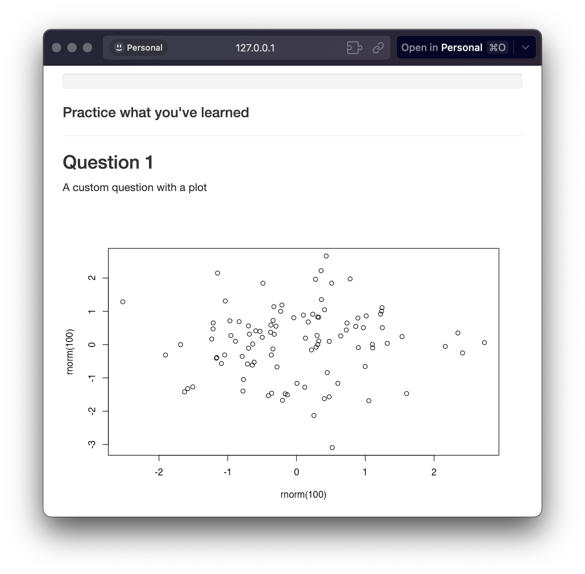

```{r, include = FALSE}
knitr::opts_chunk$set(
  collapse = TRUE,
  comment = "#>"
)
```

```{r warning=FALSE, message=FALSE, include=FALSE}
pkgload::load_all()
```

`shinyQuiz` provides versatile functions customizing your questions beyond the predefined question types. By using `create_question()` and `create_question_raw()` functions, you can tailor your quizzes to suit a wide array of educational scenarios and learning styles.
In this guide, we will delve into the power of these two functions, demonstrating how to craft custom questions and incorporate raw HTML for enhanced question formatting.

```{r setup}
library(shinyQuiz)
```

## Maximizing `create_question()`

`create_question()` automatically generates the necessary HTML to create the question prompt. However, it can also take display custom HTML. `htmltools` and `shiny` include many functions to convert R code into HTML.

For example, a custom plot can be included in the question by passing a plot to `shiny::renderPlot()` and wrapping the entire prompt using `htmltools::tagList()`. Note that some HTML functions will not print correctly so using `shinyQuiz::preview_app()` is recommended.

```{r eval=FALSE}
create_question(
  htmltools::tagList(
    htmltools::p("A custom question with a plot"),
    shiny::renderPlot(plot(rnorm(100), rnorm(100))),
  ),
  add_slider(10, 50, 30, correct = 20),
  label = 'Select 20'
)
```

<br>
<p align="center">

</p>
<br>


```{r eval=FALSE}
create_question(
  htmltools::tagList(
    htmltools::p("A custom question with a table"),
    reactable::reactable(mtcars),
  ),
  add_slider(10, 50, 30, correct = 20),
  label = 'Select 20'
)
```

<br>
<p align="center">

</p>
<br>


## Full Customization with `create_question_raw()`

`create_question_raw()` gives you more control over the question and answer options. You can use any Shiny input function to create the choices, and you define your own grading logic.

Three elements are required for `create_question_raw()`:  
  - `prompt`: An HTML div defining the question and any accompanying elements. You can use HTML tags, Shiny inputs, or any other UI elements. This is where you set up what the user will see. At a minimum this should include a shiny `input` object that will be used to collect the user's answer.  
  - `grader`: A function to takes the user input as an argument and returns back TRUE or FALSE. This gives you full control over the grading logic.  
  - `correct_answer_pretty`: Text representing the correct answer. Useful for displaying a "pretty" version in the quiz's summary table.  
  - `user_answer_prettifier`: An optional function that takes the user input as a argument and returns back a "pretty" version of it. Useful for displaying cleaner answers in the quiz's summary table. The default is `paste0(user_input, collapse = ", ")`.  

For example, you could use `shiny::selectInput()` to specify a `select` list. Note the use of `shiny::NS('quiz')` to define the `inputId`. This is required for `shinyQuiz` to find the user's answer. 

```{r eval=FALSE}
create_question_raw(
  prompt = htmltools::div(
    htmltools::p("my question"),
    shiny::selectInput(
      inputId = shiny::NS('quiz')('answers'),
      label = 'Select 5',
      choices = c(4, 5, 6)
    )
 ),
 grader = \(user_input) user_input == '5',
 correct_answer_pretty = '5'
)
```

Take caution when defining the `grader` function as some elements may return back an object of a different class that you are expected. It's recommended to always self-test your quiz.
