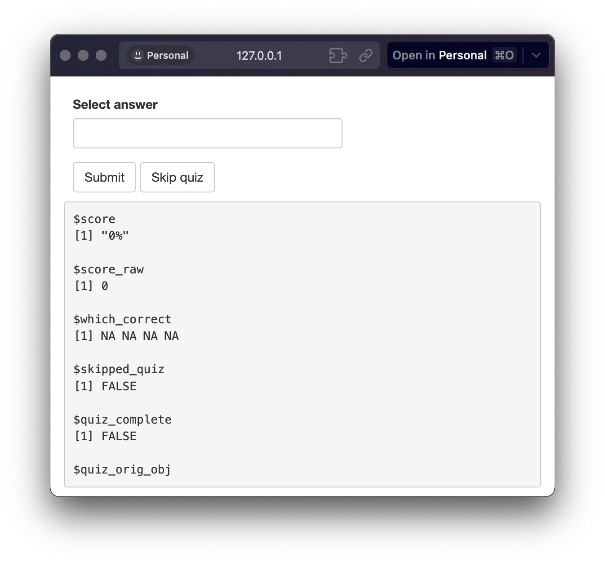

```{r, include = FALSE}
knitr::opts_chunk$set(
  collapse = TRUE,
  comment = "#>"
)
```

```{r warning=FALSE, message=FALSE, include=FALSE}
pkgload::load_all()
```


`shinyquiz` is a powerful R package that allows users to create interactive quizzes within R Shiny applications. This guide provides a step-by-step introduction to creating a quiz, integrating it into your Shiny app, and adjusting the options.

## Installation

`shinyquiz` is now on CRAN. You can also install the latest development version from GitHub:

``` r
# install latest release from cran
install.packages('shinyquiz')

# latest development version
# install.packages("remotes")
remotes::install_github('priism-center/shinyquiz')
```

## Creating Questions

To start creating a quiz, first load the package.


```{r setup}
library(shinyquiz)
```

A quiz is composed of individual questions created via the `create_question()` function. These objects are then integrated into a quiz using the `create_quiz()` function.

Individual questions take a prompt and an arbitrary amount of answer choices via `add_numeric()`, `add_choice()`, or `add_slider()`,

```{r}
q1 <- create_question(
  'What is 2+2?',
  add_numeric(correct = 4)
)
```

```{r}
q2 <- create_question(
  'What is the capital of France?',
  add_choice('Lyon'),
  add_choice('Paris', correct = TRUE),
  add_choice('Strasbourg'),
  label = 'Select a city'
)
```

```{r}
q3 <- create_question(
  'Which cities are capital cities?',
  add_choice('Paris', correct = TRUE),
  add_choice('London', correct = TRUE),
  add_choice('Munich'),
  label = 'Select all that are correct'
)
```

```{r}
q4 <- create_question(
  'What is 1.5 / 2?',
  add_slider(correct = 0.75)
)
```

<br>

## Forming a Quiz

Create the quiz from the questions and preview it.

```{r}
quiz <- create_quiz(q1, q2, q3, q4)
```
```{r eval=FALSE}
preview_app(quiz)
```

<br>
<p align="center">

</p>
<br>

The `preview_app()` launches the quiz in a Shiny instance to quickly check the quiz design. You can also print the quiz via the R console to quickly preview it without a Shiny runtime. The latter is quick but lacks interactivity and some elements do not render well.

<br>

## Validating Grading

Accurate grading is essential for the effectiveness of your shinyquiz quizzes. Automated grading is convenient, but it's important to verify its correctness.

### Understanding Automated Grading

- Default function: The `setequal()` function is used by default to test if the user's response is correct. 
- Text input: With `add_text()`, user input is, by default, cleaned before checking for equality, which may affect the outcome. 
- Varied inputs: Shiny elements might return values as lists or vectors, and users may enter rounded values instead of precise ones, leading to unexpected grading results.

If you find that the grading is giving unexpected results, you may want to consider using `create_question_raw()`. This function gives you finer control over how the grading is handled. 

<br>

## Integrating into Your Shiny Application

You can integrate the quiz into your Shiny app by adding it to the server and UI functions. Here's an example:

```{r eval=FALSE}
# UI
ui <- fluidPage(
  h3('My Excellent Shiny App'),
  quiz_ui(quiz)
)

# Server
server <- function(input, output) {
  quiz_server(quiz)
}

shinyApp(ui = ui, server = server)
```

<br>

## Adjusting Options

There are several options you can adjust to customize the behavior of your quizzes. Here are some examples:

- `ns`: A namespace function created from `shiny::NS()`. The default is `shiny::NS('quiz')`. When including multiple quizzes within an application or when nesting a quiz within a module, this should be adjusted in addition to the `ns` argument within each `create_question()`. See the [Quiz in a Module article](nested_modules) for a working example.
- `messages`: A `messages` object created from `create_messages()`. Controls the messages shown at the end of the quiz. 
- `class`: A CSS class to add to the quiz container. Useful for custom styling. 
- `sandbox`: Should the quiz be put into sandbox mode? TRUE/FALSE. Quiz no longer ends of the first wrong, removes the progress bar, and grading does not include unattempted questions. Note that the presence of a random question automatically triggers sandbox mode. It can be overridden with set_quiz_options(override = TRUE)  
- `end_on_first_wrong`: Should the quiz terminate once the user gets one question wrong? Defaults to TRUE.  
- `progress_bar`: Show the progress bar? Defaults to TRUE.    
- `progress_bar_color`: Color of the progress bar. Can be a [hex color code](https://www.w3schools.com/colors/colors_hexadecimal.asp) or [rgba()](https://www.w3schools.com/colors/colors_rgb.asp). Default is #609963.     

```{r eval=FALSE}
create_quiz(q1, q2, q3, q4, options = set_quiz_options(sandbox = TRUE))
```

<br>

## Consuming the Quiz Output

The `quiz_server()` outputs a reactive summary of the quiz that can be consumed by your Shiny application. Here, we run the `quiz_server()` and capture it's output. We then print it using `verbatimTextOutput` and `renderPrint`. You can pass the summary to any other functions as you wish.

```{r eval=FALSE}
# UI
ui <- fluidPage(
  h3('My Excellent Shiny App'),
  quiz_ui(quiz),
  verbatimTextOutput('quizSummary')
)

# Server
server <- function(input, output) {
  quiz_summary <- quiz_server(quiz)
  output$quizSummary <- shiny::renderPrint(quiz_summary())
}

shinyApp(ui = ui, server = server)
```

<br>
<p align="center">

</p>
<br>

That's the basic idea! With the `shinyquiz` package, you can easily create interactive quizzes and add them to your Shiny applications. If you want to share your app with others, be sure to check out the [Deploying to shinyapps.io article](deploying). Enjoy quiz making! 
