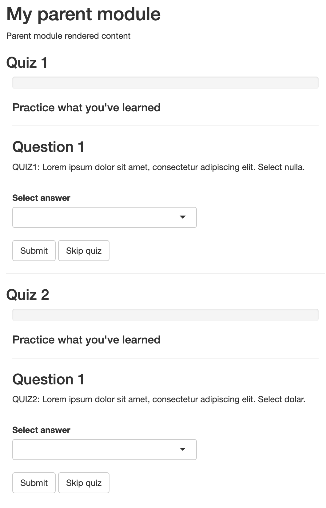

```{r, include = FALSE}
knitr::opts_chunk$set(
  collapse = TRUE,
  comment = "#>"
)
```

```{r warning=FALSE, message=FALSE, include=FALSE}
pkgload::load_all()
```

[Shiny modules](https://mastering-shiny.org/scaling-modules.html) are an effective way to reuse code across different Shiny applications, providing a modular and clean approach to app development. By combining the capabilities of `shinyQuiz` with Shiny modules, you can create reusable, customizable quiz components that can be effortlessly integrated into any of your Shiny applications.
We will walk you through the process of modifying the namespace of a quiz to correctly work within a Shiny module.

```{r setup}
library(shinyQuiz)
```

We're creating two quizzes that will be embeded within a single module to demonstrate the complexity of the namespace argument. If you only have one quiz for a given module then you can skip the second quiz.

Each of these quizzes will have a namespace that corresponds to the namespace of the module and a unique id for the quiz.

```{r eval=FALSE}
# create namespaces for each quiz
parent_mod_id <- 'mod1'
ns <- shiny::NS(parent_mod_id)
ns1 <- shiny::NS(ns('quiz'))
ns2 <- shiny::NS(ns('quiz2'))
```

The namespaces should be passed to the individual questions via `ns = ns1` and to the `create_quiz()` call via the options.

```{r eval=FALSE}
# create two distinct quizes
quiz <- create_quiz(
  create_question(
    'QUIZ1: Lorem ipsum dolor sit amet, consectetur adipiscing elit. Select nulla.',
    add_choice('auctor'),
    add_choice('nulla', correct = TRUE),
    ns = ns1
  ),
  create_question(
    'QUIZ1: Mauris congue aliquet dui, ut dapibus lorem porttitor sed. Select 600.',
    add_choice('600', correct = TRUE),
    add_choice('800'),
    ns = ns1
  ),
  options = set_quiz_options(ns = ns1)
)

quiz2 <- create_quiz(
  create_question(
    'QUIZ2: Lorem ipsum dolor sit amet, consectetur adipiscing elit. Select dolar.',
    add_choice('elit'),
    add_choice('dolar', correct = TRUE),
    ns = ns2
  ),
  create_question(
    'QUIZ2: Mauris congue aliquet dui, ut dapibus lorem porttitor sed. Select 400.',
    add_choice('400', correct = TRUE),
    add_choice('200'),
    ns = ns2
  ),
  options = set_quiz_options(ns = ns2)
)
```

The quizzes can now be placed inside your module as you normally would.

```{r eval=FALSE}
# UI for your module
parent_ui <- function(id) {
  ns <- shiny::NS(id)
  htmltools::tagList(
    htmltools::h2("My parent module"),
    shiny::textOutput(ns('text')),
    htmltools::h3("Quiz 1"),
    quiz_ui(quiz),
    htmltools::hr(),
    htmltools::h3("Quiz 2"),
    quiz_ui(quiz2)
  )
}

# server for your module
parent_server <- function(id) {
  shiny::moduleServer(id, function(input, output, session) {
    # non-quiz content
    output$text <- shiny::renderText("Parent module rendered content")
    
    # quizzes
    quiz_server(quiz)
    quiz_server(quiz2)
  })
}

# highest level of the shiny app
ui <- shiny::fluidPage(
  parent_ui(parent_mod_id)
)
server <- function(input, output, session) {
  parent_server(parent_mod_id)
}
shiny::shinyApp(ui, server)
```

<br>
<p align="center">

</p>
<br>
